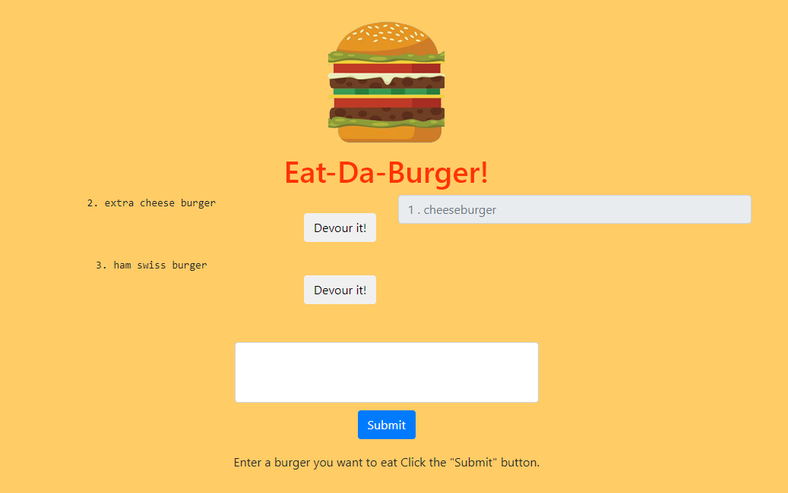

# sequelizedBurger

This application will take in a burger entered by user.  There is a option to click "Devoured", and by doing so, it'll then remove that burger to the right hand side and gray it out. 

Check it out here: https://fast-eyrie-90367.herokuapp.com

 

## Technologies Used:
This application is made with Node.js, Express.js, and Handlebars. It is deployed with Heroku. The data is being added and manipulated with MySQL and Sequelized. 